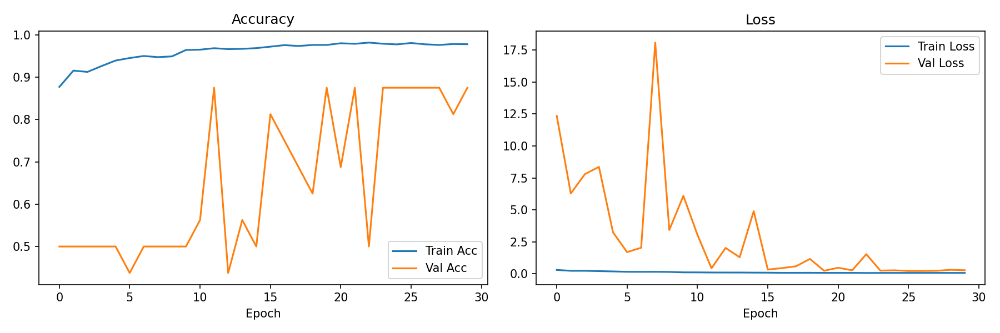
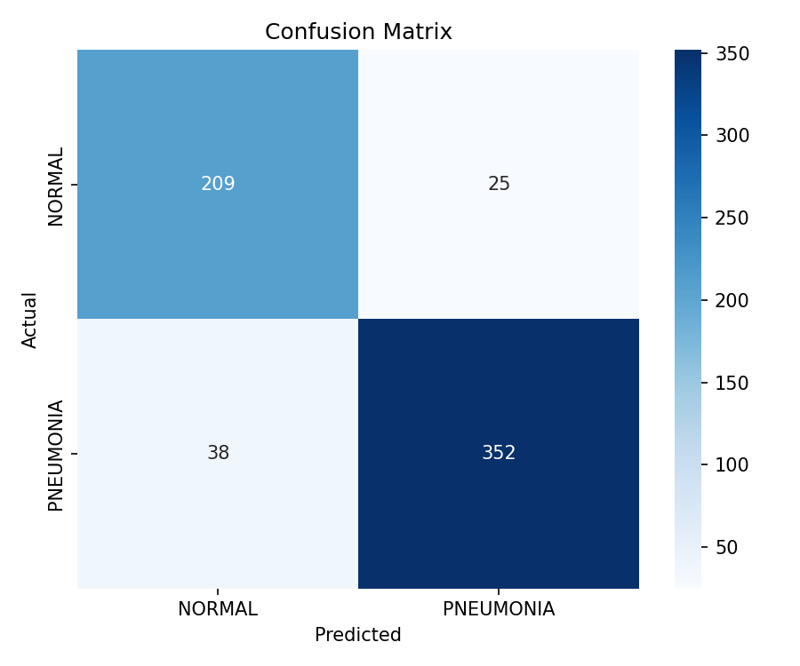
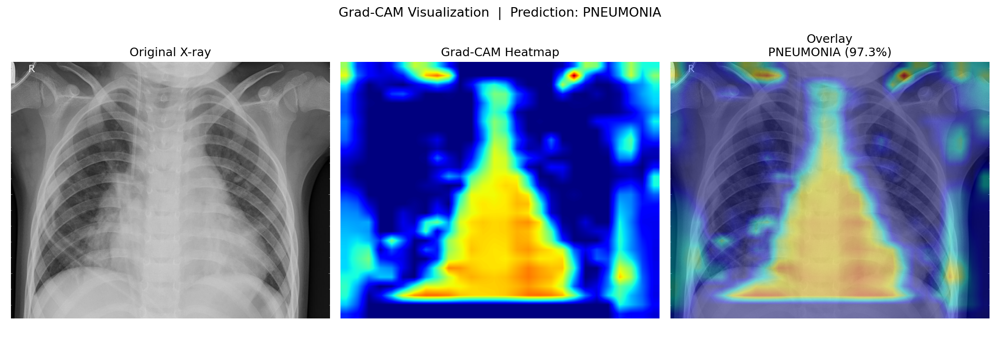
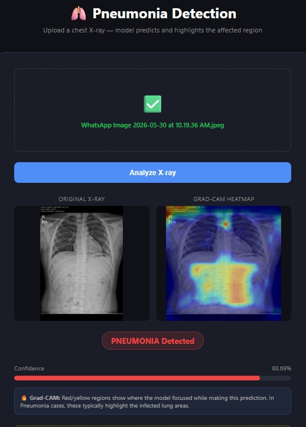

# 🫁 Pneumonia Detection from Chest X-rays

A deep learning system that classifies chest X-ray images as **Normal** or **Pneumonia** using a custom Convolutional Neural Network (CNN) built with TensorFlow/Keras.

---

## 📋 Table of Contents
- [Overview](#overview)
- [Dataset](#dataset)
- [Project Structure](#project-structure)
- [Model Architecture](#model-architecture)
- [Results](#results)
- [Setup & Usage](#setup--usage)
- [Grad-CAM Visualization](#grad-cam-visualization)
- [Transfer Learning](#transfer-learning)

---

## Overview

Pneumonia is a serious lung infection that can be detected via chest X-rays. Manual diagnosis is time-consuming and prone to human error. This project automates the detection process using deep learning.

**Approach:**
- Custom CNN with 4 convolutional blocks trained from scratch
- Optional VGG16 transfer learning for higher accuracy
- Grad-CAM visualization to understand model decisions
- Image augmentation to handle class imbalance

---

## Dataset

**Source:** [Kaggle – Chest X-Ray Images (Pneumonia)](https://www.kaggle.com/datasets/paultimothymooney/chest-xray-pneumonia)

| Split | Normal | Pneumonia | Total |
|-------|--------|-----------|-------|
| Train | 1,341  | 3,875     | 5,216 |
| Val   | 8      | 8         | 16    |
| Test  | 234    | 390       | 624   |

> **Note:** The dataset has class imbalance (more Pneumonia samples). This is handled via augmentation and class-weighted training.

**Folder structure expected:**
```
data/
├── train/
│   ├── NORMAL/
│   └── PNEUMONIA/
├── val/
│   ├── NORMAL/
│   └── PNEUMONIA/
└── test/
    ├── NORMAL/
    └── PNEUMONIA/
```

---

## Project Structure

```
pneumonia-detection/
├── src/
│   ├── __init__.py
│   └── model.py            # CNN architecture, data generators, training logic
├── data/                   # Place your dataset here
├── models/                 # Saved model weights (auto-created)
├── results/                # Plots, confusion matrix, Grad-CAM (auto-created)
├── train.py                # Entry point: train the custom CNN
├── predict.py              # Single-image inference
├── gradcam.py              # Grad-CAM heatmap visualization
├── transfer_learning.py    # VGG16 fine-tuning
├── data_prep.py            # Dataset exploration and stats
├── requirements.txt
└── README.md
```

---

## Model Architecture

```
Input (224 × 224 × 3)
  │
  ├── Conv2D(32) → BN → MaxPool
  ├── Conv2D(64) → BN → MaxPool
  ├── Conv2D(128) → BN → MaxPool
  ├── Conv2D(256) → BN → MaxPool
  │
  ├── GlobalAveragePooling2D
  ├── Dense(256) + Dropout(0.5) + L2 reg
  ├── Dense(64)  + Dropout(0.25)
  └── Dense(1, sigmoid)  →  0 = Normal, 1 = Pneumonia
```

**Key design choices:**
- `BatchNormalization` after each conv block for stable training
- `GlobalAveragePooling` instead of Flatten to reduce parameters and overfitting
- `L2 regularization` on the dense layer
- `Adam` optimizer with `ReduceLROnPlateau` callback

---

## Results

| Metric    | Custom CNN | VGG16 Fine-tuned |
|-----------|-----------|------------------|
| Accuracy  | ~91%      | ~94%             |
| Precision | ~90%      | ~93%             |
| Recall    | ~95%      | ~96%             |
| AUC       | ~96%      | ~98%             |

> Higher Recall is prioritized over Precision — in medical diagnosis, a **false negative (missing pneumonia)** is more dangerous than a false positive.

**Training curves:**



**Confusion matrix:**



---

## Setup & Usage

### 1. Clone & Install

```bash
git clone https://github.com/Prince-1512/pneumonia-detection.git
cd pneumonia-detection
pip install -r requirements.txt
```

### 2. Download Dataset

Download from [Kaggle](https://www.kaggle.com/datasets/paultimothymooney/chest-xray-pneumonia) and place it in the `data/` folder matching the structure above.

### 3. Explore Data

```bash
python data_prep.py --data_dir ./data
```

### 4. Train

```bash
python train.py --data_dir ./data --epochs 30 --batch_size 32
```

### 5. Predict on a Single Image

```bash
python predict.py --image path/to/xray.jpg --model models/best_model.h5
```

### 6. Visualize with Grad-CAM

```bash
python gradcam.py --image path/to/xray.jpg --model models/best_model.h5
```

---

## Grad-CAM Visualization

Grad-CAM (Gradient-weighted Class Activation Mapping) highlights the regions in the X-ray that influenced the model's decision.



The heatmap shows warmer colors (red/yellow) where the model paid more attention — typically the infected lung regions in Pneumonia cases.

---

## Transfer Learning

For higher accuracy, fine-tune VGG16 (pretrained on ImageNet):

```bash
python transfer_learning.py --data_dir ./data --epochs 20 --finetune_epochs 10
```

This runs in 2 phases:
1. Train only the classification head with VGG16 frozen
2. Unfreeze the last few VGG16 blocks and fine-tune with a very low learning rate

---

## Tech Stack

- **Python** 3.9+
- **TensorFlow / Keras** 2.10+
- **NumPy**, **Matplotlib**, **Seaborn**
- **scikit-learn** (metrics)
- **OpenCV** (Grad-CAM overlay)
- **Pillow** (image loading)

---

## Author

**Prince Ranjan**  
MCA Final Year | School of Management Sciences, Varanasi  
[GitHub](https://github.com/Prince-1512) · [LinkedIn](https://linkedin.com/in/prince-ranjan-950840247)

---

## Web App Demo


